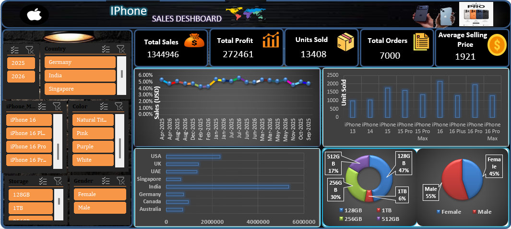

# 📱 iPhone Sales Excel Dashboard

An interactive **iPhone Sales Dashboard** built in Microsoft Excel to analyze sales performance, profitability, product demand, customer demographics, storage preferences, countries, and monthly sales trends.

The project uses a **7,000-record iPhone sales dataset** and combines Excel formulas, Pivot Tables, charts, summary tables, and dashboard visualizations to transform raw sales data into meaningful business insights.

---

## 🎯 Project Objective

The objective of this project is to build an interactive and visually appealing Excel dashboard that helps analyze iPhone sales data and answer key business questions such as:

* How much total revenue was generated?
* How many iPhone units were sold?
* Which iPhone models perform best?
* Which countries generate the highest sales?
* Which storage capacity is most popular?
* How are sales distributed by gender?
* How do sales change month by month?
* What is the overall profit generated from sales?

---

## 📈 Key Performance Indicators

| KPI                    |             Value |
| ---------------------- | ----------------: |
| 🛒 Total Orders        |         **7,000** |
| 📦 Total Units Sold    |        **13,408** |
| 💰 Total Sales         |   **$13,449,462** |
| 📈 Total Profit        | **$2,724,614.90** |
| 🧾 Average Order Sales |     **$1,921.35** |

---

## 🔍 Dashboard Analysis

The dashboard provides analysis across multiple dimensions:

### 📅 Monthly Sales Analysis

Tracks total sales across different months to identify sales trends and fluctuations over time.

### 📱 Model-wise Unit Sales

Analyzes the number of units sold for different iPhone models to identify product demand.

### 🌍 Country-wise Sales

Compares sales performance across countries and highlights important geographic markets.

### 💾 Storage-wise Sales

Analyzes sales based on storage capacity such as 128GB, 256GB, and other available configurations.

### 👥 Gender-wise Sales

Provides a breakdown of units sold based on customer gender.

### 🎨 Color-wise Analysis

Analyzes customer preferences across different iPhone colors.

### 📊 Pivot Table Analysis

Uses Pivot Tables to summarize and explore the underlying sales dataset efficiently.

---

## 🛠️ Tools & Technologies

* **Microsoft Excel**
* Pivot Tables
* Excel Charts
* Excel Formulas
* Data Analysis
* KPI Cards
* Dashboard Design
* Data Visualization
* Interactive Filtering

---

## 📂 Project Structure

```text
iPhone-Sales-Excel-Dashboard/
│
├── README.md
├── iPhone_Sales_Dashboard.xlsx
└── Dashboard_Preview.png
```

---

## 📁 Excel Workbook Structure

The workbook contains multiple sheets designed for different stages of analysis:

| Sheet                      | Purpose                                       |
| -------------------------- | --------------------------------------------- |
| `Dashboard`                | Main interactive dashboard                    |
| `iPhone_Sales_Data`        | Raw sales dataset                             |
| `summary`                  | KPI summary and key metrics                   |
| `pivot_table`              | Pivot-based analysis                          |
| `Chart_Data`               | Supporting data for visualizations            |
| `Total_Sales_By_Month`     | Monthly sales analysis                        |
| `Unit_Sold_Models_Wise`    | Model-wise unit analysis                      |
| `Total_Sales_Country_Wise` | Country-wise sales analysis                   |
| `Total_sales_storage_Wise` | Storage-wise sales analysis                   |
| `Unit_Sold_Gender_Wise`    | Gender-wise unit analysis                     |
| `Questions`                | Business questions and dashboard requirements |

---

## 📊 Dataset

The dataset contains **7,000 iPhone sales orders** with information including:

* Order ID
* Order Date
* iPhone Model
* Storage
* Color
* Country
* Gender
* Units Sold
* Unit Price
* Total Sales
* Profit
* Month
* Year

This structure allows the dashboard to perform product, geographic, demographic, financial, and time-based analysis.

---

## 💡 Key Business Metrics

The dashboard focuses on five primary KPIs:

**Total Orders**
Number of individual sales orders recorded in the dataset.

**Total Units Sold**
Total quantity of iPhones sold across all orders.

**Total Sales**
Total revenue generated from iPhone sales.

**Total Profit**
Profit generated from the recorded sales transactions.

**Average Order Sales**
Average sales value generated per order.

---

## 🎨 Dashboard Features

* 📌 Professional KPI cards
* 📊 Interactive charts
* 📅 Monthly sales analysis
* 📱 iPhone model analysis
* 🌍 Country-wise analysis
* 💾 Storage-wise analysis
* 👥 Gender-wise analysis
* 🎨 Color-wise analysis
* 🔄 Pivot-based data analysis
* 📈 Business-focused visualizations
* 🧩 Supporting calculation sheets

---

## 🚀 How to Use

1. Download `iPhone_Sales_Dashboard.xlsx`.
2. Open the workbook using Microsoft Excel.
3. Navigate to the **Dashboard** sheet.
4. Use the available filters/slicers to explore the data.
5. Review KPI cards and charts.
6. Explore the supporting analysis sheets for detailed information.

> **Note:** For the best experience, open the workbook in Microsoft Excel rather than viewing it directly in the GitHub browser.

---

## 📌 Project Highlights

This project demonstrates practical skills in:

* Data cleaning and preparation
* Excel data analysis
* Business intelligence concepts
* KPI development
* Pivot Table analysis
* Data visualization
* Dashboard development
* Business-oriented storytelling

---

## 👨‍💻 Author

**Aman Pareek**

Aspiring Data Analyst & AI Enthusiast

### Skills

Python | SQL | Excel | Power BI | Data Analysis | Data Visualization

---

## ⭐ Project

If you find this project useful or interesting, feel free to ⭐ the repository.

## 📊 Dashboard Preview


